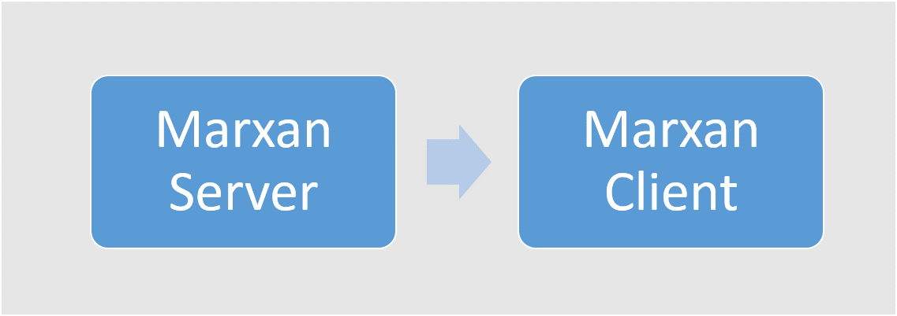
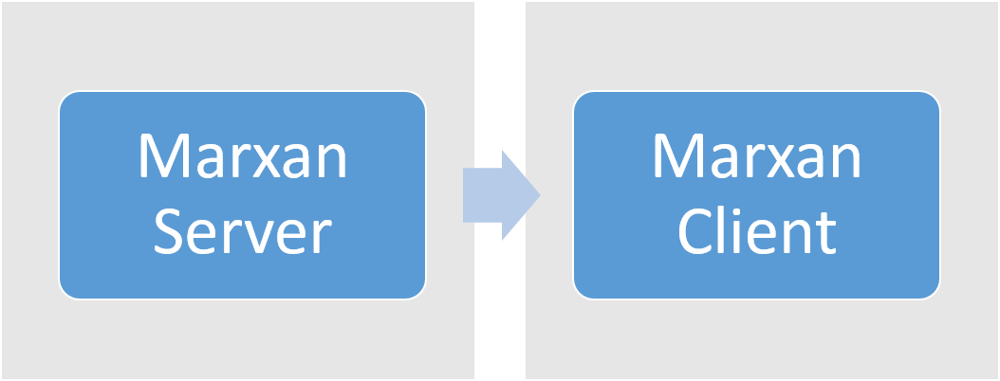

# Administrator Documentation
This documentation is aimed at IT staff within organisations who wish to host and use Marxan Web within their organisation. It covers the architecture, installation, configuration and security and maintenance. If you just want to use Marxan Web without hosting it yourself, then you can simply use a hosted service which requires no installation. For more information see [Migration Guide - Which should I choose? A hosted service or hosted within my organisation](/docs_migration.md#which-should-i-choose-a-hosted-service-or-hosted-within-my-organisation).  

## Architecture
The Marxan Web software comprises a set of discrete components that work together in a network to provide the tools to do systematic conservation planning. This section outlines how these components work together and what the options are for deploying and using Marxan Web in your organisation.  

### Client/server
Marxan Web comprises software running on a server ([marxan-server](https://github.com/andrewcottam/marxan-server)) and software running on the client ([marxan-client](https://github.com/andrewcottam/marxan-client)). These two separate bits of software work together in a loosely-coupled way through web services with the marxan-server providing the data storage and processing layer and marxan-client providing the user interface to that content. For more information on the architecture for each of these bits of software, see the relevant GitHub repos.  

These two separate components can be installed on a local, network or cloud-based machine, either on the same machine or on different machines. These different options are shown in the following sections.  

#### Single machine installation
In a single machine installation, both marxan-server and marxan-client are installed on the same physical machine.

This is typical of a Windows installation on a desktop computer or a Unix installation on a network machine. For more information on installing on Windows, see [Windows](#windows). For more information on installing on Unix, see [Unix](#unix).  

#### Separate machine installation
The marxan-server and marxan-client software can also be installed on separate machines, although this is less common. 

In this scenario, marxan-client is accessing resources on another computer which may be outside the 

### Marxan Servers and the Marxan Registry

### Cross-platform
### 
## Installation
### Windows
### Unix
### Mac
## Configuration
### Configuration files
#### server.dat
#### user.dat
#### runlog.dat
### Securing access
#### Using SSL
#### Cookie authentication
#### CORS restrictions
#### Disabling security
### Database configuration
## Maintenance
### Updates 
To software just pull
### Routines tasks
#### Removing clumping projects
## FAQ
## Providing Feedback
