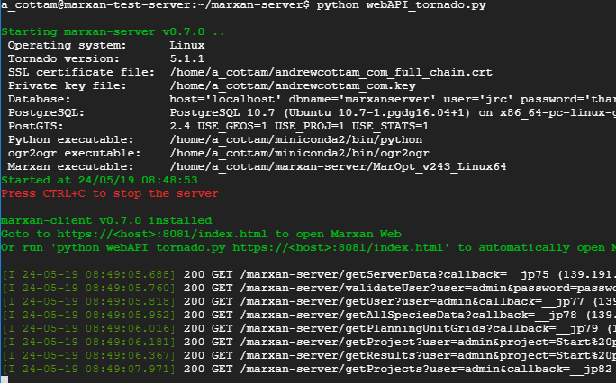
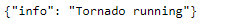

# Administrator Documentation
* TOC {:toc}  

This documentation is aimed at IT staff within organisations who wish to host and use Marxan Web within their organisation. It covers the architecture, installation, configuration and security and maintenance. If you just want to use Marxan Web without hosting it yourself, then you can simply use a hosted service which requires no installation. For more information see [Migration Guide - Which should I choose? A hosted service or hosted within my organisation](/docs_migration.md#which-should-i-choose-a-hosted-service-or-hosted-within-my-organisation).  

## Architecture
The Marxan Web software comprises a set of discrete components that work together in a network to provide the tools to do systematic conservation planning. This section outlines how these components work together and what the options are for deploying and using Marxan Web in your organisation.  

### Client/server
Marxan Web comprises software running on a server ([marxan-server](https://github.com/andrewcottam/marxan-server)) and software running on the client ([marxan-client](https://github.com/andrewcottam/marxan-client)). These two separate bits of software work together in a loosely-coupled way through web services with the marxan-server providing the data storage and processing layer and marxan-client providing the user interface to that content (running in a browser). For more information on the architecture for each of these bits of software, see the relevant GitHub repos.  

These two separate components can be installed on a local, network or cloud-based machine, either on the same machine or on different machines. These different options are shown in the following sections.  

#### Single machine installation
In a single machine installation, both marxan-server and marxan-client are installed on the same physical machine. Marxan Web is cross-platform and this is typical of a Windows installation on a desktop computer or a Unix installation on a network machine. For more information on installing on Windows, see [Windows](#windows). For more information on installing on Unix, see [Unix](#unix).  

#### Separate machine installation
The marxan-server and marxan-client software can also be installed on separate machines, although this is less common and requires some additional configuration. The main advantage is that the client can then link to other installations of marxan-server.  

### Marxan Servers and the Marxan Registry
Wherever Marxan Web is installed, when it is run the login screen shows a list of marxan-servers that are available and that you can connect to. These have been registered in the Marxan Registry and these are essentially instances of marxan-server that organisations are hosting and want to make public and share. Any organisation can register their own instance of marxan-server and can control whether it is read-only or read-write and from which domains. For more information see [CORS restrictions](#cors-restrictions) and [ENABLE_GUEST_USER](#enable_guest_user).  To register your organisation in the Marxan Registry contact: andrew.cottam@ec.europa.eu.  

## Installation
Marxan Web is cross-platform which means that it will install and run on any operating system (although there may be some slight differences in the support on different platforms). Instructions for installing on different operating systems are given below.  

### Windows
A Windows installer is available for installing Marxan Web on Windows. For more information, see the [Windows Releases](https://github.com/andrewcottam/marxan-web/releases) page.  

### Unix
marxan-server and marxan-client have to be installed separately on Unix operating systems. For more information on installing these, see the relevant GitHub repos: [marxan-server](https://github.com/andrewcottam/marxan-server) and [marxan-client](https://github.com/andrewcottam/marxan-client).  

### Mac
The installation of Marxan Web on Mac operating systems has not been done yet as there are some issues with installing PostGIS which is a prerequisite of marxan-server.  

## Configuration
There are various ways that marxan-server can be configured from overall settings that apply at the server level, such as database connections, security settings and access control, to settings at the user level. In a normal installation none of this configuration needs to be done, but there are a few basic steps that will increase the security of your installation. This sections describes how to do that.  

### Configuration files
Configuration in marxan-server is done through a set of configuration files that are installed in the marxan-server folder and sub-folders. The following configuration files are used:  

- server.dat - provides overall configuration for the marxan-server instance (in the root folder)
- user.dat - provides options for each registered user (in each users folder)
- runlog.dat - provides a log of all of the runs that have been done in the marxan-server instance (in the root folder)

These files are described in the following sections. 

#### server.dat
The server.dat file contains settings that apply at the server level. These settings are described in the following sections. If any of the settings in the server.dat file are changed, then the marxan-server will need to be restarted for those changes to take effect. For more information see [Starting/stopping marxan-server](#startingstopping-marxan-server).  

##### ENABLE_GUEST_USER 
This value is set using the Marxan Web application but it can also be set directly in the server.dat file. For more information see [User Guide - Enabling Guest Users](https://andrewcottam.github.io/marxan-web/documentation/docs_user.html#enabling-guest-users-admin-users-only).  

##### SERVER_NAME 
If this instance of marxan-server has been registered in the Marxan Registry, then you can set this value to override the server name that is in the Marxan Registry. This name will appear in the list of Marxan Servers when the login page is shown in Marxan Web.  

##### SERVER_DESCRIPTION 
If this instance of marxan-server has been registered in the Marxan Registry, then you can set this value to override the server description that is in the Marxan Registry. This description will appear in the list of Marxan Servers when the login page is shown in Marxan Web.  

##### COOKIE_RANDOM_VALUE
This value is used to encrypt all cookies that are exchanged between marxan-server and marxan-client and therefore if the default value is not changed then potentially malicious hackers could intercept and decode cookies to try to gain illegal access.  

##### PERMITTED_DOMAINS
This is a list of domains that are allowed to access services from marxan-server to prevent Cross-Origin Resource Sharing vulnerabilities. For more information see [CORS restrictions](#cors-restrictions). To allow read-write access from a specific domain, append the domain to the list of existing domains (separated by a comma). Domains not on this list will only have read-only access.  

##### DATABASE_NAME, DATABASE_HOST, DATABASE_USER, DATABASE_PASSWORD
If you want to connect to a different database then set the database configuration information in the relevant settings.

##### CERTFILE
The location of an digital certificate file (*.crt) used with a web browser to provide SSL authentication (i.e. https). CRT files are used to verify a secure website's authenticity, distributed by certificate authority companies such as GlobalSign, VeriSign and Thawte. The full certificate chain needs to be within the certificate file.   

##### KEYFILE 
This is the location of a private key for this machine that is used with the certificate file to provide SSL authentication. Reference a private key file (*.key).  

#### user.dat
The user.dat file is used to manage user settings in Marxan Web and most of the settings are managed in the Marxan Web application. However, they can be set manually if there are issues with a users settings.  

##### LASTPROJECT 
The name of the last project that the user loaded.  

##### SHOWPOPUP 
A flag to indicate if the user wants to see the popup on the map with information about the planning units.  

##### NAME, EMAIL, PASSWORD
The users profile information.

##### BASEMAP 
The name of the default base map that the user has selected.

##### ROLE 
The current role for the user.

#### runlog.dat
The runlog.dat provides a log of all of the runs that have been done in the marxan-server instance. In some cases where the server crashed or quit unexpectedly, there may be logs in the run that were not terminated properly. These records can be manually deleted from the log if required.    

### Securing access
There are a number of best practices to ensure that the marxan-server is secure and while these changes are not mandatory, they will increase the security to your data.  

#### Using SSL
Secure-Sockets Layer is way of encrypting communication between computer systems and prevents unauthorised access. To enable SSL on marxan-server, set the CERTFILE and KEYFILE values in the server.dat file.  

#### Cookie authentication
Authentication between marxan-client and marxan-server is done using secure cookie authentication and all secure cookies are encrypted using the COOKIE_RANDOM_VALUE in the server.dat file. See [COOKIE_RANDOM_VALUE](#cookie_random_value) for more information.  

#### CORS restrictions
To prevent Cross-Origin Resource Sharing vulnerabilities, by default marxan-server only allows read-write access from those domains that are listed in the PERMITTED_DOMAINS value in the server.dat file. All other domains will only have read-only access. See [PERMITTED_DOMAINS](#permitted_domains) for more information.  

#### Disabling security
To disable all security in marxan-server, set the DISABLE_SECURITY constant in the webAPI_tornado.py file to True and restart marxan-server. All services will now be available without any requirement for authentication.  

### Database configuration
To configure you own database to use with marxan-server, set the appropriate settings in the server.dat file. See [DATABASE_NAME, DATABASE_HOST, DATABASE_USER, DATABASE_PASSWORD](#database_name-database_host-database_user-database_password) for more information.  

## Maintenance
This section outlines what tasks need to be done periodically or on an ad-hoc basis to ensure Marxan Web runs without problems.  

### Diagnosing problems  
If Marxan Web is not running properly, then there are a number of tools to help you diagnose the problem. 

#### marxan-client console
In the Marxan Web client all error messages are reported at the bottom of the screen in a pop up message as shown below. 

This is a brief description of the problem - a more complete description and stack trace is available in the browsers console. To open the browsers console:

- In Chrome, goto the Customise and control Google Chrome button in the top right. Click on More tools, Developer Tools and then in the tabs at the bottom of the screen click on the Console tab. The full error message is shown in red.
- In Firefox, goto the Open menu in the top right. Click on Web Developer, Browser Console. The full error message is shown in red.

#### Clearing cache and service worker
The Marxan Web client uses caching and service workers to improve performance but when you need to diagnose problems they can often get in the way by caching previous versions of the software. To clear the cache and the servive worker, use Chrome and do the following:

- Open the browser console - see [marxan-client console](#marxan-client-console)
- Click on the Application tab and in the left pane click on Clear Storage
- Click on the Clear site data button to clear the sites cache
- In the left pane click on Service Workers
- Click on Unregister in the right hand side

#### marxan-server log
If you need to diagnose problems in the marxan-server, you can view the marxan-server log which is shown when you start running marxan-server. For more information see [Starting/stopping marxan-server](#startingstopping-marxan-server). An example screen shot of the marxan-server log is shown below running on Unix.  

This log shows diagnostic information about the marxan-server software including the versions of components and the location of key files. It also shows a full log of all of the requests to the marxan-server from the marxan-client applications. If errors occur in marxan-server these are printed in this log.  

### Routine tasks
#### Starting/stopping marxan-server
marxan-server runs as a Python script from the marxan-server folder and on Windows installations it will be started automatically when you click on the Launch Marxan Web shortcut. It can also be started manually (for other operating systems or if you want to start it manually on Windows):  

- Navigate to the marxan-server folder
- Start the marxan-server by entering python webAPI_tornado.py

You should see the marxan-server log output - for more information see [marxan-server log](#marxan-server-log).  

 marxan-server can be stopped using one of the following methods:

 - If the marxan-server log is visible, then press CTRL+C or CTRL+Fn+Pause or close the window in which it is running
 - If the marxan-server log is not visible:
  -  Use the operating system command to find the process ID of the running Python process, e.g. on Windows use TASKLIST and look for the python.exe process, on Unix use ps -A
  -  Kill that process using the operating system command, e.g. on Windows use TASKKILL /pid <pid>, on Unix use kill -9 <pid>

#### Starting/stopping Postgresql/PostGIS server
If the PostGIS server is stopped for any reason, it can be restarted using the operating system specific commands. For more information search online for starting/stopping the Postgresql/PostGIS server.  

#### Testing the marxan-server is running 
To test whether the marxan-server is running properly, goto:

http://\<domain\>:8081/marxan-server/testTornado
 
You should see the following if marxan-server is running properly:

If you don't then you can try to clear your site cache and service worker. For more information see [Clearing cache and service worker](#clearing-cache-and-service-worker). 

#### Removing clumping projects
Marxan Web uses temporary projects to be able to see the effects of changes to the BLM value and sometimes these projects are not deleted. These projects are stored in the users/_clumping folder. All of the projects in this folder can be deleted whenever necessary. 

### Updates 
To install software updates to marxan-server:  

- Stop marxan-server - see [Starting/stopping marxan-server](#startingstopping-marxan-server)
- In the command prompt, navigate to the marxan-server folder
- Type git pull
- Start marxan-server and check that the version is updated in the marxan-server log - see [marxan-server log](#marxan-server-log)

To install software updates to marxan-client:  

- In the command prompt, navigate to the marxan-client folder
- Type git pull
